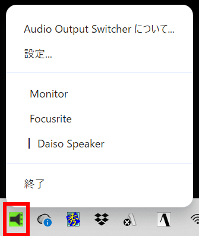
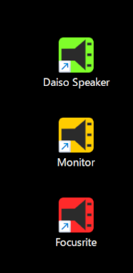
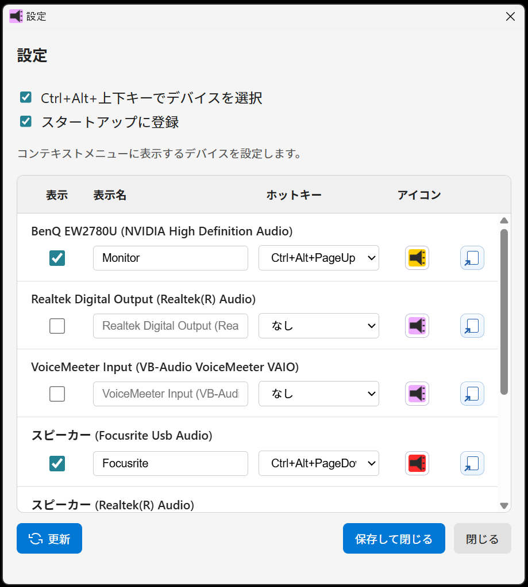

# Audio Output Switcher

[English](README.md) | [日本語](README.ja.md)

Windows 10/11向けのオーディオ出力デバイス切り替えツールです。
類似ツールは数あれど、「ちょうどいい」を目指して作りました。

## 概要

各種言語に対応しています。<br>

トレイアイコンから簡単に「既定のオーディオ出力デバイス」を切り替えられます。<br>
特定のデバイスに切り替えられるショートカットをデスクトップやタスクバー等に置くこともできます。<br>
デバイスごとにアイコンの色を変えられるので、一目で選択されたデバイスがわかります。




デバイスの表示名（別名）を設定可能で、直感的にデバイスを選べます。<br>
あまり使わないデバイスは非表示にできるのでメニューでの選択に迷いません。<br>
ホットキーにデバイスを割り当ててキー操作で切り替えることもできます。
非表示にしたデバイスにもホットキーを割り当てられるので、普段選択対象ではないデバイスを特定の作業の時だけ選択する、といったことが可能です。




## 機能

- トレイアイコンからのデバイス切り替え
- 設定ダイアログでデバイスを表示/非表示・表示名設定
- 設定ダイアログでデバイスごとのグローバルホットキー割り当て
- デバイスごとに色違いのトレイアイコンを設定して、選択中デバイスを視覚的に判別
- デスクトップやタスクバー等にデバイスごとのショートカットを置くことで、トレイに常駐させなくても切り替え可能
- デバイスが一時的に未接続でも表示名・表示設定・ホットキー設定を保持
- 非表示デバイスにもホットキーを適用可能（未接続デバイスは無視）
- 他アプリとのホットキー競合を検知して表示
- スタートアップ登録のON/OFF
- 小さなポップアップ通知（システム通知音なし）

## 注意事項

- 環境によっては(企業管理端末など) PowerShell の実行制限により動作しないことがあります。

## インストール

- インストーラの`.exe` ファイルを実行するとアプリケーションがインストールされます。
インストールが成功するとデスクトップにショートカットが作成され、アプリは起動状態になります。
継続的に利用される場合は、トレイアイコンをクリックし[設定...]から「スタートアップに登録」にチェックを入れておくと便利です。
- トレイアイコンの色でデバイスの選択状態がわかるように、Windowsの 個人用設定 > タスクバー > その他のシステムトレイアイコン にて表示をオンに設定しておくことをおすすめします。トレイアイコンをドラッグして常に表示される位置に移動させても同じことができます。
- インストーラには署名を行っていませんので "Windows によって PC が保護されました" と表示される場合があります。
その場合は「詳細情報」をクリックし表示された[実行]ボタンを押してください。
安全のため他所でダウンロードしてきたインストーラは使用しないでください。

## 使用方法

1. アプリを起動するとトレイアイコンが表示されます。
2. トレイアイコンをクリックしてコンテキストメニューを開きます。
3. 切り替えたいデバイスを選択します。
4. 設定を変更するには「設定...」を選択します。

### 設定ダイアログ

- **Ctrl+Alt+上下キーでデバイスを選択**: Ctrl+Alt+上下キーでのデバイス切り替え機能がON/OFFできます
- **スタートアップに登録**: ログイン時起動のON/OFF
- **更新**: デバイス一覧を再読み込み
- **保存して閉じる**: 設定を保存して即時反映
#### デバイスリスト内
- **表示**: トレイメニューに表示するかを切り替え
- **表示名**: デバイスに別名を設定
- **ホットキー**: デバイスごとに直接切り替えホットキーを設定（例: なし、Ctrl+Alt+Home、Shift+Alt+PageUp など）
- **アイコン**: そのデバイスが選択されているときのタスクトレイアイコンの色を選択<br>
※アイコンをデスクトップやタスクバー等にD&Dすると、そのデバイスに切り替えができるショートカットアイコンが作成できます

#### ホットキー動作

- 同じホットキーを複数デバイスに設定した場合は後勝ち（先に設定されていた側は `なし` に戻る）
- デバイス個別ホットキーは非表示デバイスにも有効
- 未接続デバイスのホットキー入力は無視
- ホットキー有効時は `Ctrl+Alt+Up/Down` の順送り切り替えも利用可能

## システム要件

- Windows 10/11
- PowerShell 5.1以上

## 開発

### 開発環境での実行

```bash
npm install
npm start
```

### ビルド

```bash
npm run make
```

### プロジェクト構造

```
resources/
├── speaker_pink.ico         # デフォルトのアプリアイコン
└── speaker_*.ico            # デバイス/トレイ/ショートカット用アイコン群

src/
├── main/
│   ├── main.js               # Electronメインプロセスのエントリ
│   ├── audio-selector.js     # オーディオデバイス操作
│   ├── device-shortcuts.js   # デバイス別ショートカット生成
│   ├── tray-icon-manager.js  # .icoベースのトレイアイコン管理
│   └── tray-popup.js         # 小型ポップアップ制御
├── preload/
│   ├── about-preload.js
│   ├── popup-preload.js
│   └── settings-preload.js
├── renderer/
│   ├── about/
│   │   └── about.html
│   ├── popup/
│   │   └── popup.html
│   └── settings/
│       ├── icon-popover.js
│       └── settings.html
└── shared/
    └── locales/
        └── *.json
```

### 技術仕様

- Electron + Electron Forge
- PowerShell + C# (動的コンパイル) でWindows Audio API操作
- JSONファイル（`device-settings.json`）による設定永続化

## ライセンス

MIT License

## 作者

合同会社オモシレーゼ (https://www.omoshiraise.com)
